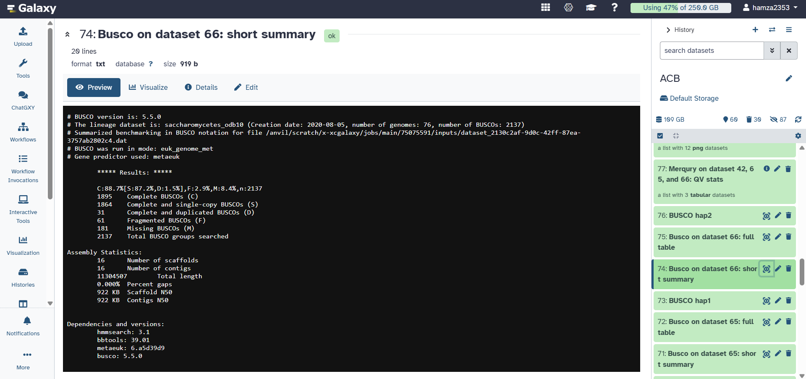
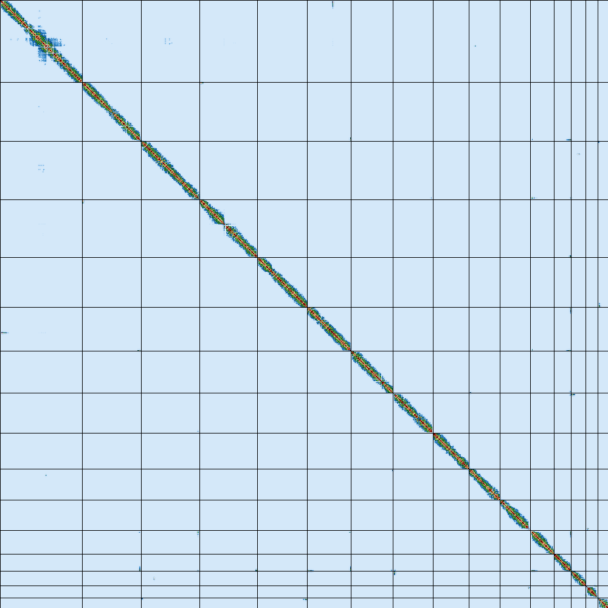

# Vertebrate Genome Assembly Pipeline (VGP)

This repository contains the workflow and documentation for a high-quality *de novo* genome assembly of a vertebrate species, completed as part of a Bioinformatics application study.

## 🧬 Project Overview
The goal was to produce a near-error-free, chromosome-level assembly by combining multiple sequencing technologies. This project follows the **Vertebrate Genomes Project (VGP)** standard pipeline to address challenges like repetitive elements and heterozygosity.

### Technologies Used:
* **PacBio HiFi:** Long, highly accurate reads (99.9% precision).
* **Bionano Genomics:** Optical mapping for hybrid scaffolding.
* **Hi-C:** Chromatin conformation capture for chromosome-level phasing.

---

## 🛠️ Pipeline Methodology
The assembly was performed on the **Galaxy Australia/Main** platform using the following stages:

1.  **K-mer Analysis:** Used `Meryl` and `GenomeScope2` to estimate genome size, heterozygosity, and repeat content.
2.  **Contig Assembly:** Utilized `hifiasm` in Hi-C phased mode to generate primary and alternate assemblies.
3.  **Purging:** Applied `purge_dups` to remove haplotypic duplications.
4.  **Scaffolding:** * Used `Bionano` for initial hybrid scaffolding.
    * Applied `YaHS` (Yet another Hi-C scaffolding tool) for final chromosome-level organization.
5.  **Validation:** Quality control via `gfastats` and `BUSCO`.

---

## 📊 Assembly Results
Based on the final QC reports from `gfastats` and `BUSCO`, the assembly achieved the following metrics:

| Metric | Result |
| :--- | :--- |
| **Total Assembly Length** | 11.3 Mb |
| **Contig N50** | 922 KB |
| **Scaffold N50** | 922 KB |
| **BUSCO Score (Complete)** | 88.7% |
| **Total Number of Scaffolds** | 16 |

---

## 📁 Detailed Results & Evidence
Full output files and quality metrics are available in the [results/](results/) directory.

### 🖼️ Key Visualizations
* **GenomeScope K-mer Profile:**
  
  *(Estimates genome size, heterozygosity, and repeat content.)*

* **BUSCO Quality Summary:**
  
  *(Assesses assembly completeness based on evolutionarily conserved genes.)*

* **Hi-C Contact Map:**
  
  *(Visualizes the final chromosome-level scaffolding connectivity and accuracy.)*

---

## 📂 Repository Structure
* `VGP_Assembly_Workflow.ga`: The full Galaxy workflow file.
* `results/`: Directory containing raw output images and statistics.
* `README.md`: Project documentation.

## 📜 References
* **Galaxy Training Network:** [Vertebrate genome assembly tutorial](https://training.galaxyproject.org/training-material/topics/assembly/tutorials/vgp_genome_assembly/tutorial.html).
* **Rhie et al. (2021):** Towards complete and error-free genome assemblies of all vertebrate species. *Nature*.
